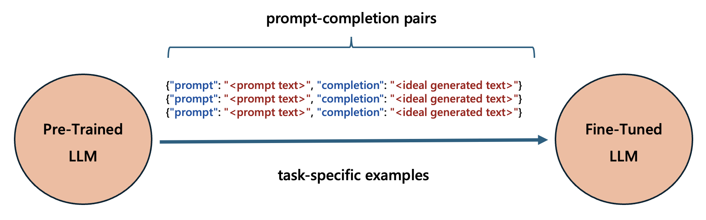

# LLM Fine-Tuning using Azure 
A fine-tuning guide for both OpenAI and Open-Source Large Lauguage Models on Azure.

## New
🔥 New (2024-11-20): Phi-3.5 Vision Fine-Tuning using LoRA 
<a href="labs/fine_tuning_notebooks/phi_fine_tuning/phi_35_vision_instruct_fine_tuning_using_lora.ipynb">[Jump to the notebook]</a>

🔥 New (2024-10-25): Phi-3 Fine-Tuning using Q-LoRA 
<a href="labs/fine_tuning_notebooks/phi_fine_tuning/phi_3_mini_4k_instruct_fine_tuning_using_qlora.ipynb">[Jump to the notebook]</a>

🔥 New (2024-10-05): Phi-3 Fine-Tuning using LoRA 
<a href="labs/fine_tuning_notebooks/phi_fine_tuning/phi_3_mini_4k_instruct_fine_tuning_using_lora.ipynb">[Jump to the notebook]</a>

🔥 New (2024-07-28): GPT-4 Fine-Tuning using Azure Machine Learning (Low-Code) Python SDK
<a href="labs/fine_tuning_notebooks/gpt_fine_tuning/gpt_4_fine_tuning.ipynb">[Jump to the notebook]</a>

🔥 New (2024-07-11): GPT-4 Fine-Tuning using Azure OpenAI UI Dashboard
<a href="labs/fine_tuning_dashboards/gpt_4_fine_tuning_aoai_dashboard.md">[Jump to the Guide]</a>

🔥 New (2024-07-04): Phi-3 Fine-Tuning using Azure Machine Learning (Low-Code) Python SDK
<a href="labs/fine_tuning_notebooks/phi_fine_tuning/phi_3_mini_4k_instruct_fine_tuning.ipynb">[Jump to the notebook]</a>

## What
Fine-Tuning, or *Supervised Fine-Tuning*, retrains an existing pre-trained LLM using example data, resulting in a new "custom" fine-tuned LLM that has been optimized for the provided task-specific examples. 
<ol></ol>

## Why
Typically, we use Fine-Tuning to:
- improve LLM performance on specific tasks.
- introduce information that wasn't well represented by the base LLM model.

Good use cases include: 
- steering the LLM outputs in a specific style or tone.
- too long or complex prompts to fit into the LLM prompt window.

## When
You may consider Fine-Tuning when:
- you have tried Prompt Engineering and RAG approaches.
- latency is critically important to the use case.
- high accuracy is required to meet the customer requirement.
- you have thousands of high-quality samples with ground-truth data.
- you have clear evaluation metrics to benchmark fine-tuned models.

## Learning Path
**Lab 1: LLM Fine-Tuning via *Azure Dashboards***
- [Lab 1.1](labs/fine_tuning_dashboards/gpt_3_fine_tuning_aoai_dashboard.md): Fine-Tuning GPT-3.5 Model (*1h duration*)
- [Lab 1.2](labs/fine_tuning_dashboards/gpt_4_fine_tuning_aoai_dashboard.md): Fine-Tuning GPT-4 Model (*1h duration*)
- [Lab 1.3](labs/fine_tuning_dashboards/llama2_fine_tuning_aml_dashboard.md): Fine-Tuning Llama2 Model (*1h duration*)

**Lab 2: LLM Fine-Tuning via *Azure Python SDK***
- [Lab 2.1](labs/fine_tuning_notebooks/gpt_fine_tuning/gpt_35_turbo_fine_tuning.ipynb): Fine-Tuning GPT-3.5 Model (*2h duration*)
- [Lab 2.2](labs/fine_tuning_notebooks/gpt_fine_tuning/gpt_4_fine_tuning.ipynb): Fine-Tuning GPT-4 Model (*2h duration*)
- [Lab 2.3](labs/fine_tuning_notebooks/llama_fine_tuning/llama_2_7b_fine_tuning.ipynb): Fine-Tuning Llama2 Model (*2h duration*)
- [Lab 2.4](labs/fine_tuning_notebooks/phi_fine_tuning/phi_3_mini_4k_instruct_fine_tuning.ipynb): Fine-Tuning Phi-3 Model (*2h duration*)

**Lab 3: LLM Fine-Tuning via *Open Source Tools***
- [Lab 3.1](labs/fine_tuning_notebooks/phi_fine_tuning/phi_3_mini_4k_instruct_fine_tuning_using_lora.ipynb): Fine-Tuning Phi-3 Model using LoRA (*3h duration*)
- [Lab 3.2](labs/fine_tuning_notebooks/phi_fine_tuning/phi_3_mini_4k_instruct_fine_tuning_using_qlora.ipynb): Fine-Tuning Phi-3 Model using Q-LoRA (*3h duration*)
- [Lab 3.3](labs/fine_tuning_notebooks/phi_fine_tuning/phi_35_vision_instruct_fine_tuning_using_lora.ipynb): Fine-Tuning Phi-3.5 Vision Model using LoRA (*3h duration*)

## Contributing
This project welcomes contributions and suggestions.  Most contributions require you to agree to a
Contributor License Agreement (CLA) declaring that you have the right to, and actually do, grant us
the rights to use your contribution. For details, visit https://cla.opensource.microsoft.com.

When you submit a pull request, a CLA bot will automatically determine whether you need to provide
a CLA and decorate the PR appropriately (e.g., status check, comment). Simply follow the instructions
provided by the bot. You will only need to do this once across all repos using our CLA.

This project has adopted the [Microsoft Open Source Code of Conduct](https://opensource.microsoft.com/codeofconduct/).
For more information see the [Code of Conduct FAQ](https://opensource.microsoft.com/codeofconduct/faq/) or
contact [opencode@microsoft.com](mailto:opencode@microsoft.com) with any additional questions or comments.

## Trademarks
This project may contain trademarks or logos for projects, products, or services. Authorized use of Microsoft 
trademarks or logos is subject to and must follow 
[Microsoft's Trademark & Brand Guidelines](https://www.microsoft.com/en-us/legal/intellectualproperty/trademarks/usage/general).
Use of Microsoft trademarks or logos in modified versions of this project must not cause confusion or imply Microsoft sponsorship.
Any use of third-party trademarks or logos are subject to those third-party's policies.

## Code of Conduct
This project has adopted the
[Microsoft Open Source Code of Conduct](https://opensource.microsoft.com/codeofconduct/).
For more information see the
[Code of Conduct FAQ](https://opensource.microsoft.com/codeofconduct/faq/)
or contact [opencode@microsoft.com](mailto:opencode@microsoft.com)
with any additional questions or comments.

## License
Copyright (c) Microsoft Corporation. All rights reserved.

Licensed under the [MIT](LICENSE) license.

### Reporting Security Issues
[Reporting Security Issues](https://github.com/microsoft/repo-templates/blob/main/shared/SECURITY.md)

