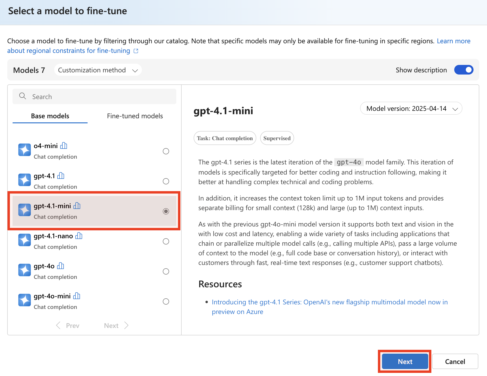

## Supervised Fine-Tuning GPT-4.1-mini Model for Text Q&A - An AI Foundry Dashboard Experience

Learn how to fine-tune a **gpt-4.1-mini** model using the Azure AI Foundry UI Dashboard.

---

### Prerequisites
* Learn the [what, why, and when to use fine-tuning.](https://learn.microsoft.com/en-us/azure/ai-services/openai/concepts/fine-tuning-considerations)
* An Azure subscription - [Create one for free.](https://azure.microsoft.com/free/cognitive-services)
* An [Azure AI project](https://learn.microsoft.com/en-us/azure/ai-foundry/how-to/create-projects) in Azure AI Foundry portal.
* An [Azure OpenAI connection](https://learn.microsoft.com/en-us/azure/ai-foundry/how-to/connections-add?tabs=azure-openai#connection-details) to a resource in a [region where fine-tuning is supported.](https://learn.microsoft.com/en-us/azure/ai-services/openai/concepts/models#fine-tuning-models)
* GPT Models that support fine-tuning so far:
  * *gpt-35-turbo-0125*
  * *gpt-4o-0806*
  * *gpt-4o-mini*
  * *gpt-4.1-mini*
  * *gpt-4.1-nano*
  * *o4-mini*
* Prepare Training and Validation datasets:
  * at least 50 high-quality samples (preferably 1,000s) are required.
  * must be formatted in the JSON Lines (JSONL) document with UTF-8 encoding.

You can check the MS Learn document [here](https://learn.microsoft.com/en-us/azure/ai-services/openai/how-to/fine-tuning?tabs=turbo%2Cpython&pivots=programming-language-studio) for more details.

---

### Step 1: Create a Project in Azure AI Foundry

1. Navigate to https://ai.azure.com/ and sign in with your Azure credentials.
2. On the landing page, click the **+ Create new** button in the top-right corner to create a new project.
<ol></ol>

3. Provide a name for your project, configure other settings such as region, resource group etc., and then select **Create**.  
<ol></ol>

---

### Step 2: Launch the *Fine-tune with your own data* Wizard

1. Inside your project, go to the **Fine-tuning** pane.
2. Click **Fine-tune model** to open the wizard.
<ol></ol>

---

### Step 3: Select the *Base model*

1. In the **Base models** pane, choose **gpt-4.1-mini** from the dropdown.
2. Click **Next** to proceed.

> 🧠 *gpt-4.1-mini is optimized for low-latency inference and supports supervised fine-tuning.*

<ol></ol>

---

### Step 4: Upload your *Training data*

1. Choose your fine-tuning method: **Supervised** or **Direct Preference Optimization** or **Reinforcement**.
2. Upload your training data using one of the following options:
   - **Upload files** from your local machine.
   - **Azure blob or other shared web locations**.
   - **Existing files on this resource** (already registered in Azure AI Foundry).

> 📌 *Ensure your data is in JSONL format with UTF-8 encoding and that you have the necessary permissions (e.g., Azure Blob Storage Contributor).*

<ol></ol>

Assume we want to **Upload files** from our local machine.
<ol></ol>

---

### Step 5 (Optional): Add *Validation data*

Validation data is optional but recommended. Upload it using the same method as training data.
<ol></ol>

---

### Step 6 (Optional): Configure *Advanced options*

You can customize hyperparameters such as:
- Epochs
- Batch size
- Learning rate
- Warmup steps

Or leave them at default values.
<ol></ol>

> 🔧 For tuning the hyperparameters, one can refer to the MS Learn document [here](https://learn.microsoft.com/en-us/azure/ai-services/openai/how-to/fine-tuning?tabs=turbo%2Cpython&pivots=programming-language-studio#configure-advanced-options) for a detailed explanation.

---

### Step 7: Review and *Submit*

1. Review your configuration.
2. Click **Submit** to start the fine-tuning job.
3. Monitor progress in the **Status** column of the **Fine-tuning** pane.
<ol></ol>

> ⏱️ *Training duration depends on dataset size and selected parameters.*

When the fine-tuning process finishes, you will see the **Status** showing **Completed**.
<ol></ol>

You can also review the various **Metrics** of your fine-tuned model.
<ol></ol>

---

### Step 8: *Deploy* your fine-tuned model

1. Once training completes, select your model in the **Fine-tuning** pane.
2. Click **Use this model**.
<ol></ol>

4. In the **Deploy model** dialog, enter a deployment name and click **Deploy**.
<ol></ol>

---

### Step 9: *Test and use* your deployed model

- Use the **Playgrounds** in Azure AI Foundry to test your model interactively.
<ol></ol>

<ol></ol>

- Or integrate it via the Completion API.

---

### Step 10 (Optional): *Clean up* resources

Delete deployments, models, and datasets when no longer needed to avoid unnecessary costs.

---

### Step 11 (Optional): *Continuous fine-tuning*

To further refine your model:
1. Start a new fine-tuning job.
2. Select your previously fine-tuned model as the base model (e.g., `gpt-4.1-mini-2025-04-14.ft-...`).
<ol></ol>

This enables iterative improvement over time.
