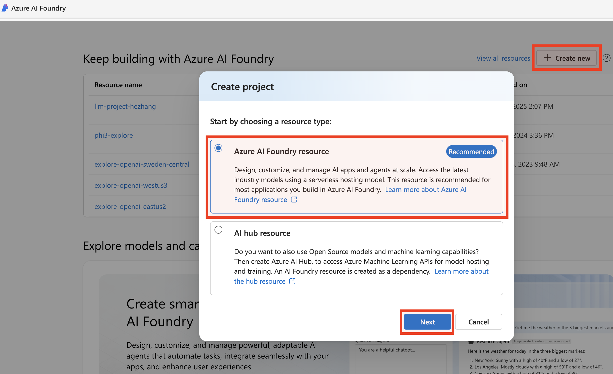

## Supervised Fine-Tuning Phi-4-mini Open-Source Model for Text Q&A - An AI Foundry Dashboard Experience

Learn how to fine-tune a **phi-4-mini-instruct** model using the Azure AI Foundry UI Dashboard.

---

### Prerequisites
* Learn the [what, why, and when to use fine-tuning.](https://learn.microsoft.com/en-us/azure/ai-services/openai/concepts/fine-tuning-considerations)
* An Azure subscription - [Create one for free.](https://azure.microsoft.com/free/cognitive-services)
* An [Azure AI project](https://learn.microsoft.com/en-us/azure/ai-foundry/how-to/create-projects) in Azure AI Foundry portal.
* Prepare Training and Validation datasets:
  * at least 70 high-quality samples (preferably 1,000s) are required.
  * must be formatted in the JSON Lines (JSONL) document with UTF-8 encoding.

You can check the MS Learn document [here](https://learn.microsoft.com/en-us/azure/ai-services/openai/how-to/fine-tuning?tabs=turbo%2Cpython&pivots=programming-language-studio) for more details.

---

### Step 1: Create a Project in Azure AI Foundry

1. Navigate to https://ai.azure.com/ and sign in with your Azure credentials.
2. On the landing page, click the **+ Create new** button in the top-right corner to create a new project.
<ol></ol>

3. Provide a name for your project, configure other settings such as region, resource group etc., and then select **Create**.  
<ol></ol>

---

### Step 2: Search the Open-Source Model from the *Model catalog* Pane

1. Type *phi-4* within the Search Bar. 
2. Click **Phi-4-mini-instruct** to open the model card.
<ol></ol>

---

### Step 3: Select the *Managed compute*

Click the **Fine-tune** button on top, and then select **Managed compute**.
<ol></ol>

---

### Step 4: Give Basic Configs

Fill in the basic information.
<ol></ol>

---

### Step 5: Select Compute (*GPU*)

Choose a proper GPU compute hosted in your subscription (e.g. *A100* or *H100* preferred).
<ol></ol>

> 📌 *Ensure you have enough GPU quota. Otherwise you can request it via the Azure Portal*

---

### Step 6: Upload your *Training data*

