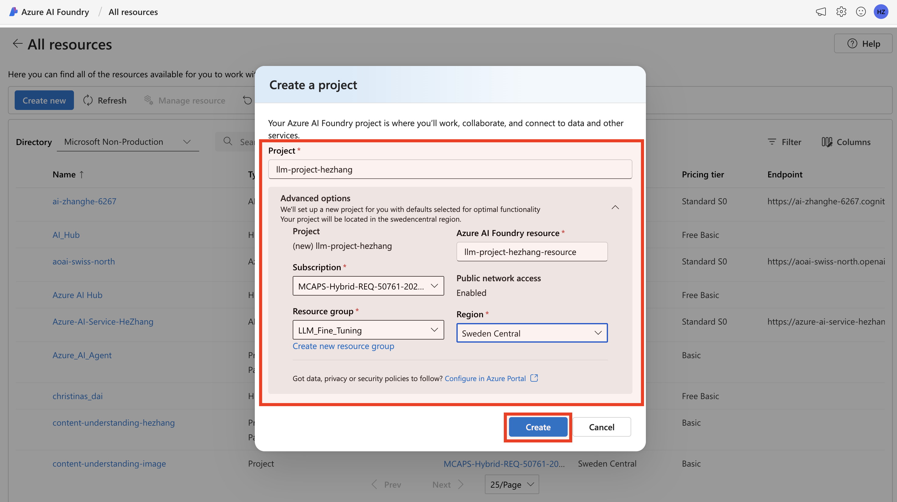
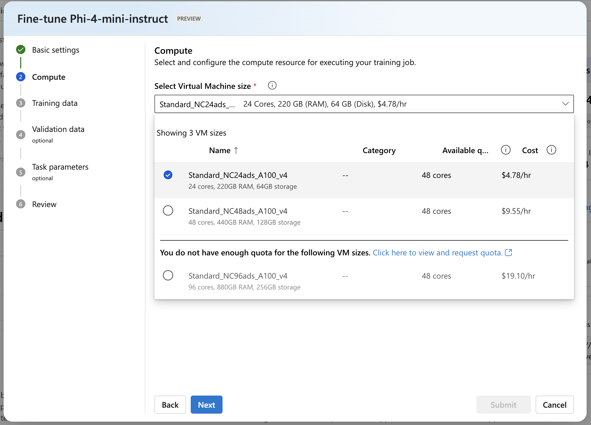

## Supervised Fine-Tuning Phi-4-mini Open-Source Model for Text Q&A - An AI Foundry Dashboard Experience

Learn how to fine-tune a **phi-4-mini-instruct** model using the Azure AI Foundry UI Dashboard.

---

### Prerequisites
* Learn the [what, why, and when to use fine-tuning.](https://learn.microsoft.com/en-us/azure/ai-services/openai/concepts/fine-tuning-considerations)
* An Azure subscription - [Create one for free.](https://azure.microsoft.com/free/cognitive-services)
* An [Azure AI project](https://learn.microsoft.com/en-us/azure/ai-foundry/how-to/create-projects) in Azure AI Foundry portal.
* Prepare Training and Validation datasets:
  * at least 70 high-quality samples (preferably 1,000s) are required.
  * must be formatted in the JSON Lines (JSONL) document with UTF-8 encoding.

You can check the MS Learn document [here](https://learn.microsoft.com/en-us/azure/ai-services/openai/how-to/fine-tuning?tabs=turbo%2Cpython&pivots=programming-language-studio) for more details.

---

### Step 1: Create a Project in Azure AI Foundry

1. Navigate to https://ai.azure.com/ and sign in with your Azure credentials.
2. On the landing page, click the **+ Create new** button in the top-right corner to create a new project.
<ol></ol>

3. Provide a name for your project, configure other settings such as region, resource group etc., and then select **Create**.  
<ol></ol>

---

### Step 2: Search the Open-Source Model from the *Model catalog* Pane

1. Type *phi-4* within the Search Bar. 
2. Click **Phi-4-mini-instruct** to open the model card.
<ol></ol>

---

### Step 3: Select the *Managed compute*

Click the **Fine-tune** button on top, and then select **Managed compute**.
<ol></ol>

---

### Step 4: Give Basic Configs

Fill in the basic information.
<ol></ol>

---

### Step 5: Select Compute (*GPU*)

Choose a proper GPU compute hosted in your subscription (e.g. *A100* or *H100* preferred).
<ol></ol>

> 📌 *Ensure you have enough GPU quota. Otherwise you can request it via the Azure Portal*

---

### Step 6: Upload your *Training data*

1. Choose the task type as: **Chat completion**.
2. Upload your training data using one of the following options:
   - **Upload files** from your local machine.
   - **Data in Azure AI Foundry** (already registered in Azure AI Foundry).

> 📌 *Ensure your data is in JSONL format with UTF-8 encoding and that you have the necessary permissions (e.g., Azure Blob Storage Contributor).*

Assume we want to **Upload files** from our local machine.
<ol></ol>

---

### Step 7: (Optional): Add *Validation data*

Validation data is optional but recommended. Upload it using the same method as training data.
<ol></ol>

---

### Step 8 (Optional): Setup *Task parameters (hyper-parameters)*

You can customize task parameters or hyperparameters such as:
- Epochs
- Batch size
- Learning rate
- Warmup steps

Or leave them at default values.
<ol></ol>

> 🔧 For tuning the hyperparameters, one can refer to the MS Learn document [here](https://learn.microsoft.com/en-us/azure/ai-services/openai/how-to/fine-tuning?tabs=turbo%2Cpython&pivots=programming-language-studio#configure-advanced-options) for a detailed explanation.

---

### Step 9: Review and *Submit*

1. Review your configuration.
2. Click **Submit** to start the fine-tuning job. 
<ol></ol>

---

### Step 10: Check Fine-Tuning *Status*

You can monitor progress in the job details page of the **Fine-tuning** pane.
<ol></ol>

> ⏱️ *Training duration depends on dataset size and selected parameters.*

When the fine-tuning process finishes, you will see the **Status** showing **Completed**.

---

### Step 11: Check Fine-Tuning *Performance Metrics*

You can review the various **Metrics** of your fine-tuned model.
<ol></ol>

---

### Step 12: *Deploy* the Fine-Tuned Model

Once training completes, you can deploy the fine-tuned model as an Management Online Endpoint.
<ol></ol>

> 📌 *Consider deploying the fine-tuned model to a GPU instance, instead of a CPU instance.*

---

### Step 13: *Check* the Deployment Status

You can check the deployment status from the **Models+endpoint** under **My assets** Pane.
<ol></ol>

> ⏱️ *It will take some time for the deployment process to finish properly.*

<ol></ol>

---

### Step 14: *Test* the Deployed Fine-Tuned Model via UI or API

1. You can directly **test** the deployed model via the simple UI.
<ol></ol>

2. You can also **consume** the deployed model via the API.
<ol></ol>

---

### Step 15 (Optional): *Clean up* resources

Delete deployments, models, and datasets when no longer needed to avoid unnecessary costs.

> 📌 *Attention: Please be cautious of the cost, as the model is charged by the GPU running hours.*
