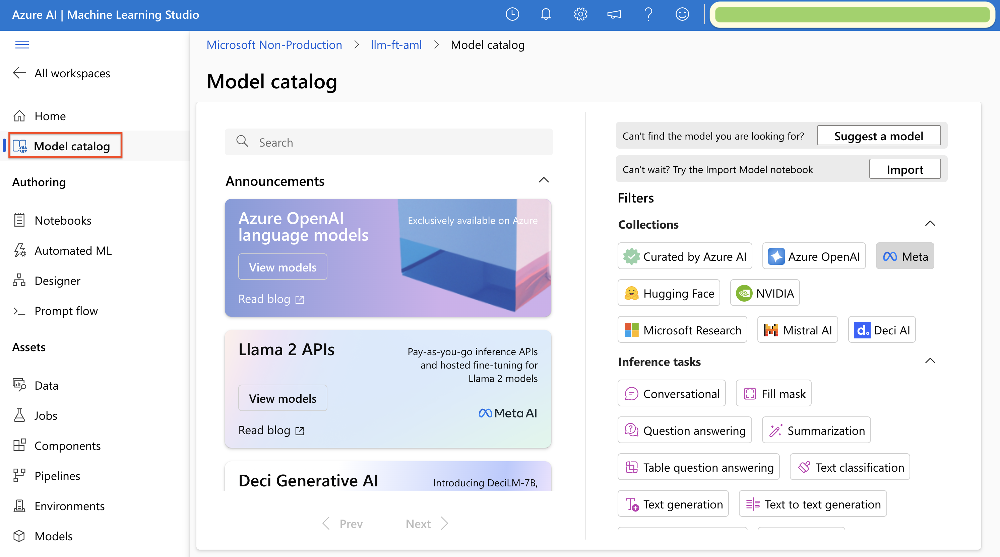
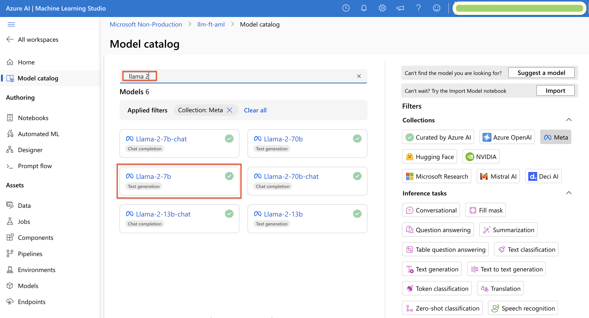
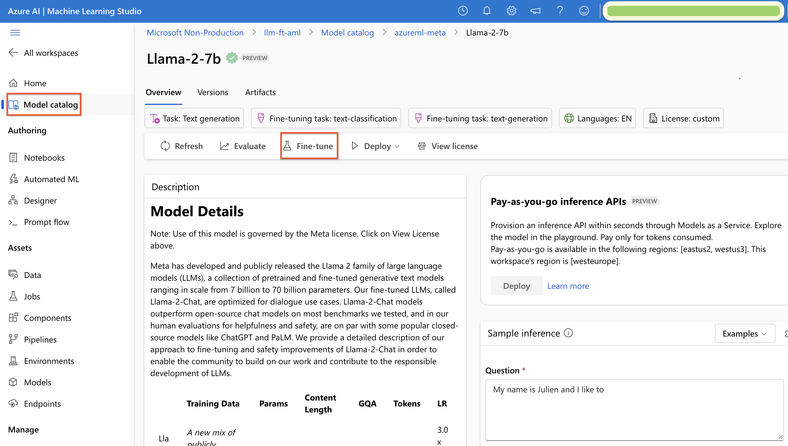
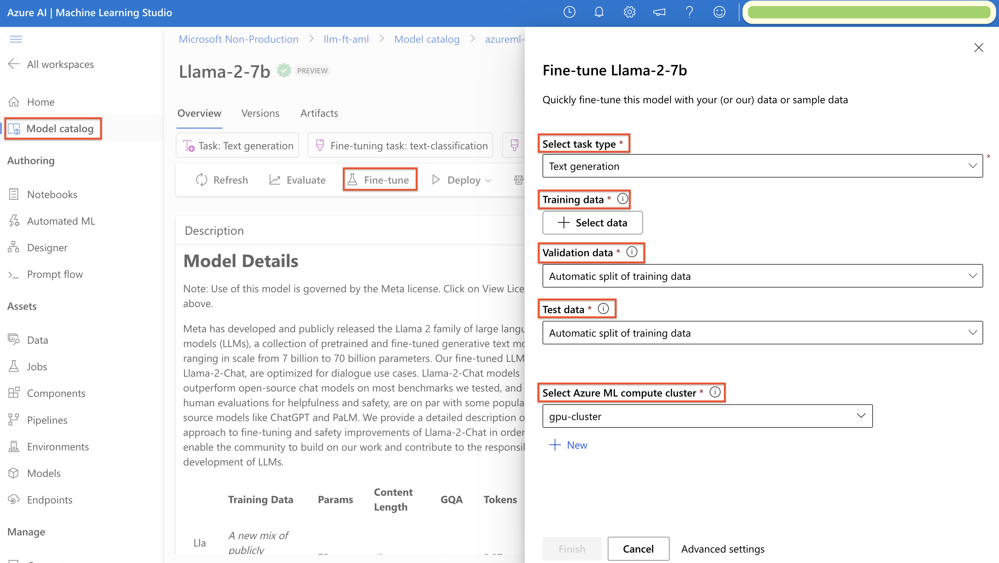

## Fine-Tuning Llama-2 Models - A Dashboard Experience
Learn how to fine-tune an Llama-2 model using Azure Machine Learning (AML) Studio - UI Dashboard.  

### Prerequisites
* Learn the [what, why, and when to use fine-tuning.](https://learn.microsoft.com/en-us/azure/ai-services/openai/concepts/fine-tuning-considerations)
* An Azure subscription.
* Access to AML Service.
* An AML resource created.
* Prepare Training and Validation datasets:
  * at least 50 high-quality samples (preferably 1,000s) are required.
  * must be formatted in the JSON Lines (JSONL) document with UTF-8 encoding.

### Step 1: Open the *Model catalog* wizard
1. Open Azure Machine Learning Studio at [https://ml.azure.com/](https://ml.azure.com/) and sign in with credentials that have access to AML resource. During the sign-in workflow, select the appropriate directory, Azure subscription, and AML resource.

2. In AML Studio, browse to the **Model catalog** pane.
<ol></ol>

3. In the search box, type <code>llama2</code>.
<ol></ol>

### Step 2: Start the fine-tuning process
Assume that you want to fine-tune the <code>llama-2-7b</code> model for a text generation task (similar process for chat-completion tasks). 

1. The first step is to press the **Fine-tune** button to start the fine-tuning process.
<ol></ol>

2. The **Fine-tune Llama-2-7b** blade lets you specify task type (choose <code>Text generation</code> for our case), training data, validation data (optional), test data (optional), and an AML compute cluster.
<ol></ol>

